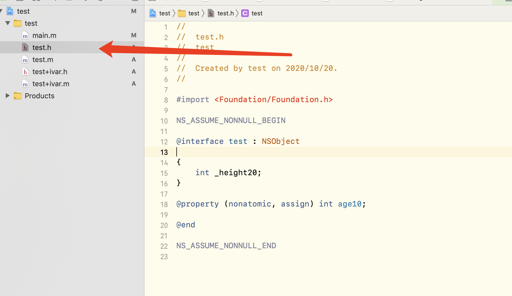
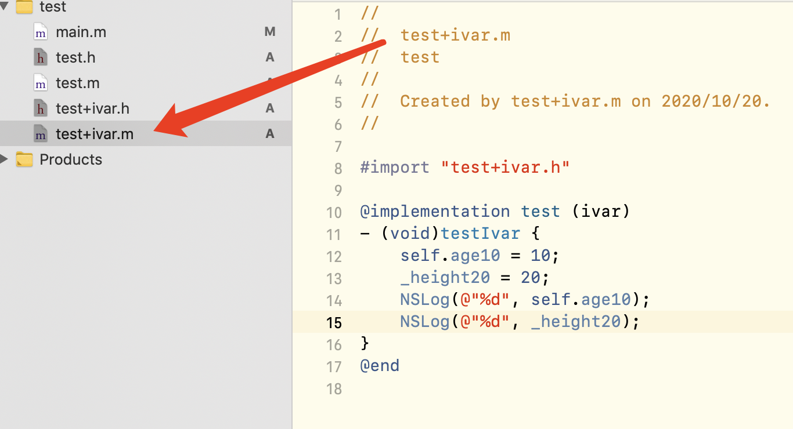
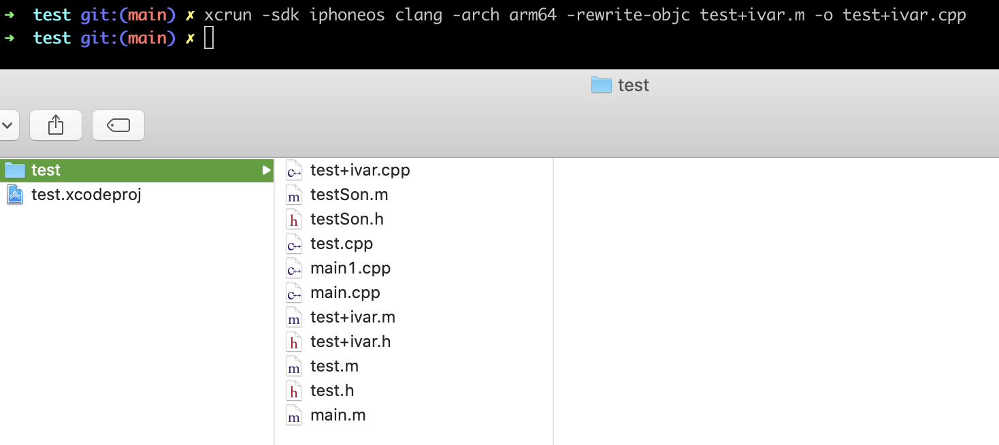
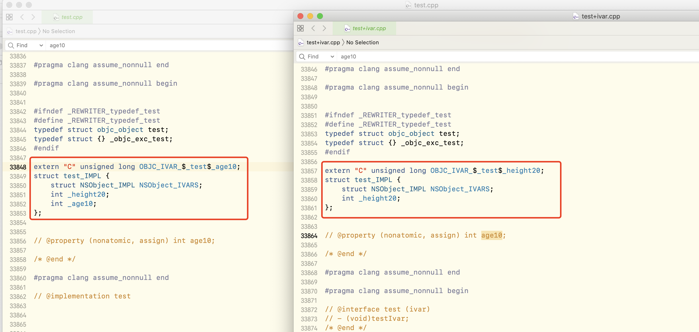
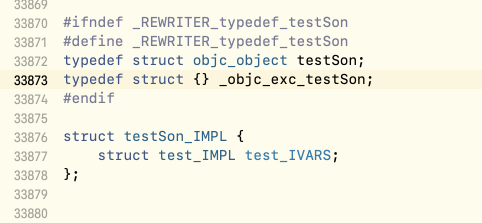
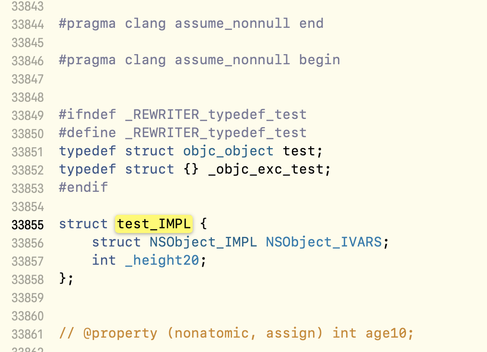

#### 关于 iOS coding 时在 Category 中引发的思考

OC 为什么在分类中不能使用原有的类的成员变量

##### 前言

想起好久好久没更博客了，上次别人问起还是去年的事了，由于种种原因加上眼看服务器也快到期了维护不下去了，遂想起迁移到公众号上来的想法，顺便记录记录点代码之外的生活。

言归正传，最近 coding 的时候发现一个问题，由于前人把一些功能写在了 Category 中，而我正需要在此功能中新增一点东西，在这里需要用到了属性 `@property` 和 懒加载，在写懒加载的时候发现 `self->` 和 `_ivar` 并不好用且 Xcode 直接报错：`does not have a member named` 或者  `Use of undeclared identifier ' _ivar '`

##### 挖掘问题

我们都知道 `@property` 会被编译器识别生成 `_ivar + getter + setter` 方法，而分类也会引用原有的类的头文件，为了方便探究这一个问题，我还用了一个属性作为区分，如下：

分类直接调用：

在这里使用 `_age10` 的话便会直接报错，因此无法做懒加载数据。

过去一直以为 `@property` 生成的属性可以直接拿来用，本人更多时候也是更倾向于 `_ivar` 的写法，如今才发现这是错的。

好的，那么为什么 `#import` 过来后编译还是会出问题我分别对这两个文件分别进行编译，这里用到的命令是

`xcrun -sdk iphoneos clang -arch arm64 -rewrite-objc 目标OC文件 -o 输出的CPP文件` （中文自行替换）

同样也有直接用 `clang -rewrite-objc xxx.m` 的，二者的区别是使用 xcrun 的话提供了指定 sdk 编译出来的文件比较小一点方便我查找：

原类和分类编译出来如下（左边是原来的类，右边是直接编译分类）：

可以看到原来的类中编译器直接帮我们生成了 `_age10` ，而分类中并没有，这也就是为什么在分类中直接使用 `_ivar` 会报错，因为结构体中并没有这个 成员变量 可以使用而直接报错，引用过来的时候并没有帮我们引用变量过来，又或者说它的声明是`private`的？

通过上面的编译和查找资料和一些 coder 们讨论了之后，大概可以猜测到 `@property` 所谓生成的 `_ivar` 它是 `private` 修饰的，使用 `_ivar` 只能在自己的 `.m` 中使用。

为此，我又新建了一个子类继承了它，通过编译后发现编译出来的与分类几乎一致：

编译过后 `testSon_IMPL` 结构体中只有 `test_IMPL` ，而 `test_IMPL` 中也没有我们想要的 `_age10` ，至此我认为 `@property` 所生成的 `_ivar` 应该是只能在自己的 `.m` 文件中使用了，对外只帮助我们声明到 `getter` `setter` 方法。这也才更符合我们的开发规范，一个是防止他人随意修改我们的成员变量，另一个我猜是涉及到加锁机制导致读写出差错的问题。

##### 结论

无论是在分类中或者是在子类中，想使用原有的类（亦或父类）的成员变量就通过 `getter` 和 `setter` 获取或者设置就好了。

虽然这只是一个小小的问题，有可以有许多方法解决同时也很好解决，例如关联属性啊、KVC等等。只是这问题背后关于一些编译、头文件引用等的知识本人尚为缺乏，通过挖掘之后也学习了新的知识点。

另外平时使用 `markdown` 比较多，在此推荐一个 `markdown`转微信公众号格式的网站：[markdow 转公众号文章格式网站](https://lab.lyric.im/wxformat/) 。本文便是使用这个排版编辑器转换，因为它还是开源的！[附上github地址](https://github.com/lyricat/wechat-format)

最后由于作者的水平有限，文中对该问题的理解难免会出现差错，如有问题还请读者们赐教（可在后台留言），谢谢。

###### 参考

\- [1] [iOS @property探究(二): 深入理解](https://www.jianshu.com/p/44d12884e24e)
\- [2] [iOS_@property 属性的本质是什么?](https://www.jianshu.com/p/7ddefcfba3cb)

